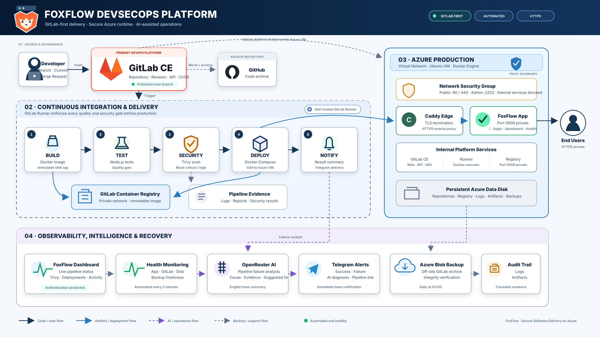

# FoxFlow

FoxFlow is a small self-hosted DevSecOps platform on Azure. It runs GitLab CE,
a dedicated GitLab Runner, an internal container registry, and a sample Node.js
application deployed automatically after build, test, and security gates pass.

## Current status

- GitLab: `https://gitlab.20-127-65-116.sslip.io`
- Application: `https://foxflow.20-127-65-116.sslip.io`
- Operations dashboard: `https://foxflow.20-127-65-116.sslip.io/dashboard`
- Health endpoint: `https://foxflow.20-127-65-116.sslip.io/health`
- Live dashboard API: `https://foxflow.20-127-65-116.sslip.io/api/dashboard`

The application home page and the live operations dashboard are separate pages
inside the same service. The dashboard reads the latest GitLab pipeline, jobs,
Runner availability, deployment result, Trivy artifact, AI failure summary, and
activity through a server-side API. The protected `GITLAB_API_TOKEN` remains
inside the application container and is never sent to the browser.

The operations dashboard requires an individual FoxFlow account. Passwords are
stored as scrypt hashes in protected GitLab CI/CD variables, and authenticated
sessions use signed, secure, HTTP-only cookies. The home page and `/health`
remain public so external health monitoring continues to work.

## Committee failure demo

After a successful deployment, run the isolated failure demonstration from the
repository root. It leaves the production application running on port `3000`.

```bash
bash scripts/committee-failure-demo.sh fail
bash scripts/committee-failure-demo.sh status
bash scripts/committee-failure-demo.sh recover
bash scripts/committee-failure-demo.sh cleanup
```
- Default branch: protected `main`
- Latest verified protected-dashboard deployment: GitLab Pipeline **#41**
- Pipeline jobs: `build`, `test`, `security_scan`, `deploy`, and `notify`
- Off-site GitLab backup: verified in Azure Blob Storage on 21 September 2026
- Backup schedule: daily at 03:00 on the VM

The verified health response is:

```json
{"status":"ok","service":"foxflow-sample"}
```

## Architecture



```text
Developer -> GitLab (primary workspace)
                 |              \
                 |               -> GitHub archive
                 v
           GitLab Runner
                    |
        build -> test -> Trivy scan
                    |
                    v
           GitLab Container Registry
                    |
                    v
          Docker Compose deployment
                    |
                    v
       Azure VM: Caddy HTTPS on port 443
                    |
                    v
          Application on private port 3000
```

The Azure VM also hosts GitLab behind HTTPS, GitLab SSH on `2222`, and the
internal-only registry on `5050`. Ports `3000`, `5050`, `8080`, and `8443`
are not exposed by the Azure NSG. Persistent GitLab data is mounted under
`/srv/foxflow` on the attached data disk.

## Repository layout

| Path | Purpose |
| --- | --- |
| `terraform/` | Azure network, VM, disk, and backup storage resources |
| `docker/` | GitLab Docker Compose configuration and environment template |
| `sample-app/` | Node.js app, tests, Dockerfile, deployment files, and CI pipeline |
| `scripts/` | Deployment, health, backup, restore, and maintenance scripts |
| `docs/` | Platform, CI/CD, backup, and integration evidence |

For a fresh Azure deployment, copy `terraform/terraform.tfvars.example` to
`terraform/terraform.tfvars`, replace the placeholder with the team member's
OpenSSH public key, then run the normal Terraform workflow.

## Quick verification

From any device that can reach the VM:

```bash
curl -i https://foxflow.20-127-65-116.sslip.io/health
```

Expected result: `HTTP/1.1 200 OK` and the JSON response shown above.

On the Azure VM:

```bash
docker ps --filter name=foxflow-app
docker ps --filter name=foxflow-gitlab
docker ps --filter name=foxflow-runner
```

All three services should be running; the application and GitLab containers
should report `healthy`.

## CI/CD behavior

Every pipeline builds and pushes an immutable image tagged with the full commit
SHA, runs application tests, and scans the image with Trivy. Deployment runs
only from the protected default branch when `DEPLOY_ENABLED=true`. The deploy
job uses strict SSH host verification and waits for the application healthcheck.

See [CI/CD documentation](docs/ci-cd.md) and the
[integration test plan](docs/integration-test-plan.md).

## Operations

```bash
./scripts/health-check.sh
./scripts/troubleshoot.sh
./scripts/backup.sh
./scripts/verify-backup.sh
```

Production also runs `foxflow-monitor.timer` every five minutes. It sends a
Telegram alert when GitLab, the Runner, the application, disk capacity, or
backup freshness changes to warning/failure, and sends a recovery message when
the condition clears. Pipeline success and failure notifications use the same
Telegram group.

`foxflow-copilot.service` adds conversational infrastructure to that Telegram
group. It understands Arabic and English requests and replies in English. The
available commands are `/status`, `/backup`, `/pipeline`,
`/logs gitlab|app|runner`, and `/restart gitlab|app|runner`. OpenRouter may only
select a tool declared in `sample-app/copilot/ai-tools.json`; it cannot generate
or execute shell commands. A restart requires `/confirm <code>` from the same
Telegram user within five minutes. Telegram privacy mode is disabled so natural
group messages reach the bot; unrelated conversation is ignored. The systemd
service runs under a dedicated unprivileged account. A root-owned helper exposes
only the fixed backup, status, log, and restart operations needed for protected
containers and mode-`0600` backup archives; model output cannot add commands or
targets.

Environment values belong in `docker/.env`, which must remain uncommitted and
mode `600`. See [platform operations](docs/platform.md) and
[backup and restore](docs/backup-restore.md).

## Team responsibilities

1. Azure infrastructure and networking.
2. GitLab platform, Docker runtime, and backups.
3. Sample application and tests.
4. CI/CD, registry, security scan, deployment, and delivery evidence.

## Security notes

- Public sign-up should remain disabled and projects private.
- Never commit `docker/.env`, SSH private keys, runner tokens, or registry credentials.
- Restoring a GitLab backup overwrites current repositories and database data;
  follow the restore document and take a fresh backup first.
